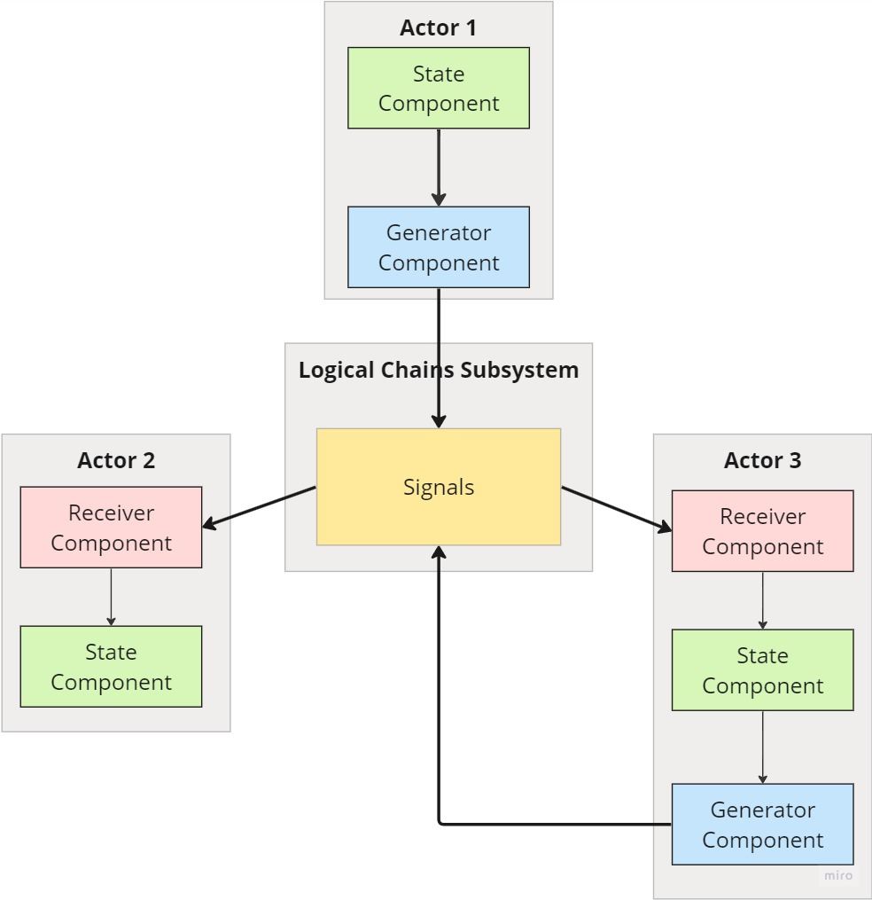
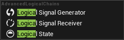
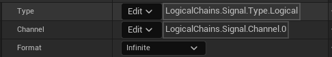
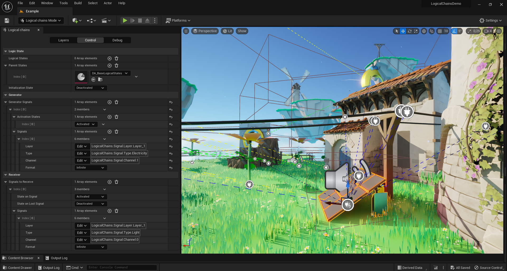
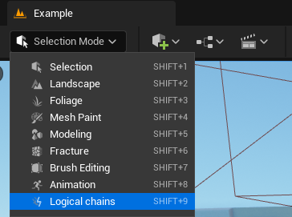
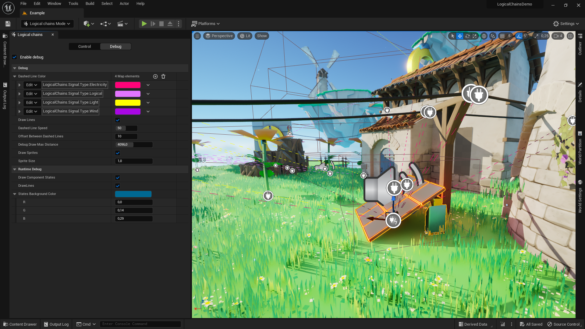
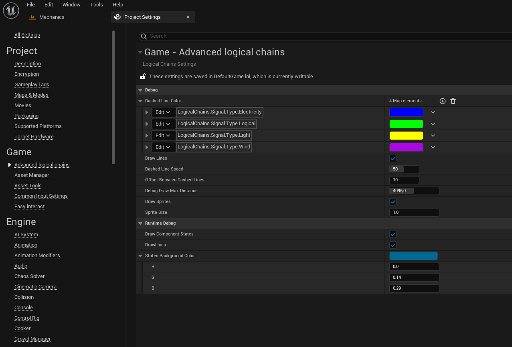
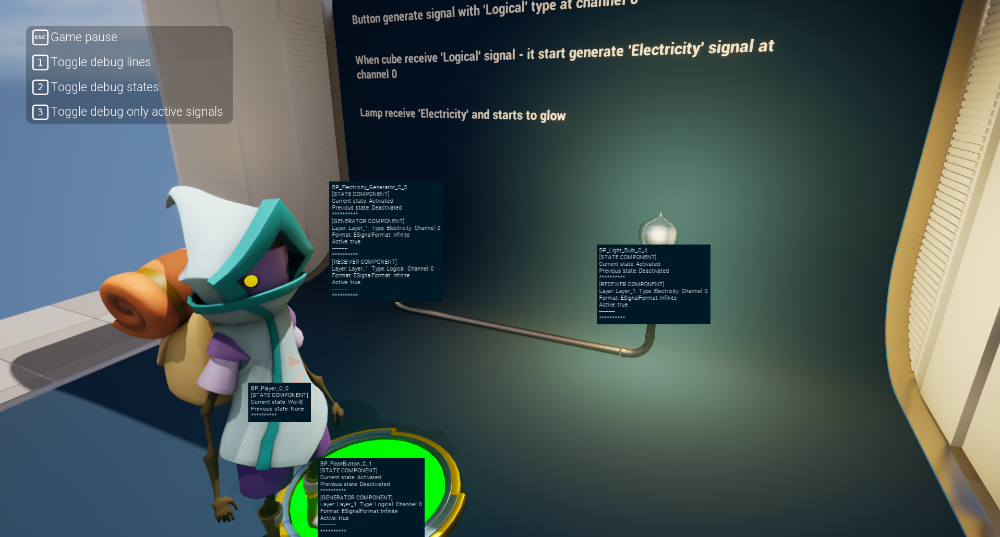

# Advanced Logical Chains
Tired of the monotonous creation of entity binding logic? Constantly thinking about replication? Saving states? With our plugin you will forget about this.

**Advanced Logic Chains is a plugin that combines several components to create complex logic based on event-like signals and states**

Spend your time making the game, not solving problems

📺Trailer: [Click here to watch on YouTube](https://youtu.be/ORbq8y8v53c)

📂Demo project: [Click here to download](https://drive.google.com/drive/folders/1iB-wzi5HbQ1Z6RaKk9LkEErb7-Z9iFu6?usp=sharing)

📂Example project for owners: [Click here to download](https://drive.google.com/drive/folders/1H2EZMnxkOb9KNYtfeYfUN-U6V6ydbAlO?usp=sharing)

📝Changelog: [Click here to see](https://github.com/SpaceRaccoonGameStudio/AdvancedLogicalChains/blob/main/CHANGELOG.md)

➡️Roadmap: [Click here to watch on YouTube](https://github.com/orgs/SpaceRaccoonGameStudio/projects/2/views/1)

🚧Issue tracker: [Click here to watch on YouTube](https://github.com/SpaceRaccoonGameStudio/AdvancedLogicalChains/issues)

💬Support Discord group: [Click here to join](https://discord.gg/4FtCJnMuxb)

✅Our other plugins: [Click here to see](https://www.unrealengine.com/marketplace/en-US/profile/Space+Raccoon+Game+Studio?count=20&sortBy=effectiveDate&sortDir=DESC&start=0)

# Table of content:
 - [Features](#features)
 - [How it is work?](#how-it-is-work)
 - [Instalation](#installation)
 - [Components](#components)
 - [Editor mode](#editor-mode)
 - [Project settings](#project-settings)
 - [Console commands](#console-commands)
 - [Examples](#examples)

# Features

* Fast and easy construction of gameplay logic
* Custom editor mode for easy creation and debugging
* Full multiplayer support
* Accelerated creation of logic in blueprints
* Easy integration
* Not need use soft/hard references pointers
* Fully written in C++
* Optimized for big worlds (full world partition support)
* Production ready

# How it is work?

## Simplified scheme of work

## Core

The plugin is based on three components - **Logical state**, **Logical receiver** & **Logical generator** components. 
Components are connected to each other using signals and states. 

## Signal

Signal are a structure containing:

1) **Type** (e.g. Logical, Electricity, Wind, etc) - This is a special gameplay tag that describes the type of signal. By default there are several ready-made types, but they can be easily extended by adding new tags
2) **Channel** (e.g. 0, 1, etc) - Channels are necessary in order not to use a huge number of unique signal types. At their core, they are gameplay tags and can also be expanded by adding new tags.
3) **Format** - Signal format: Infinity or Impulse, currently only Infinity type is supported.

## State

# Installation

First you need to install the plugin on the engine. You can do this through the official epic games launcher.

## Using plugin as project plugin

If you want use plugin as project plugin you can manually copy plugin from “**Engine/Plugins/Marketplace/LogicalChains**” folder to you “**Project/Plugins/LogicalChains**” folder

**WARNING: FOR SUCCESSFUL PACKAGE BUILD - YOU NEED USE C++ PROJECT!**

# Components
## Logic State Component
Basic element in the construction of chains. The component settings specify an array of states in which the actor can be.
It is used to switch the states of actors - it can happen manually (for example from blueprints), based on replication, or using a **Logical receiver component**. 

**Logical state component is required for all actors that want to receive or send signals**, it serves to connect signals and logic inside the actor.

**For example:**

**Light bulb**: activated, deactivated, broken

**Sun**: day, night, morning, evening

**Door**: open, closed, locked

## Logical Signal Generator Component
Generates signals based on the state of the actor.

**For example:**

**Diesel generator**: when activated, it generates noise and electricity. When deactivated, it generates nothing. When broken, it generates only noise.

## Logical Signal Receiver Component
Changes the actor's states based on received signals from other actors.

**For example:**

**Light bulb**: when it receives electricity, it changes state to activated. If the electrical signal is lost, it switches to a deactivated state (provided that the light bulb is not in the broken state).

# Editor mode

The mode is used to conveniently configure logical signal chains with support for real-time debugging

**Enable logical chains editor mode:**

**Easy draw debugging controls inside editor mode:**

# Project settings

The project settings contain the main settings for debugging the plugin. You can find it in "**Project settings -> Game -> Advanced logical chains**"

**Dashed Line Color** - setting the color of the dotted line connecting generators and receivers.

**Draw Lines** - whether or not to display connecting lines.

**Dashed Line Speed** - speed at which the dashed line will move.

**Offset Between Dashed Lines** - vertical offset between signal lines.

**Debug Draw Max Distance** - the distance from the camera at which to stop drawing lines.

**Draw Sprites** - whether or not to display components sprites.

**Draw Component States** - whether or not to display component states in runtime debug.

# Console commands

**LogicalChains.ToggleStatesDebug** - text debug for actor state

**LogicalChains.ToggleRuntimeDebug** - dashed line debug

**LogicalChains.DebugDraw.OnlyActiveSignals [true/false]** - only display active dashed lines

# Examples

## Create simple logic

## Example in demo project

