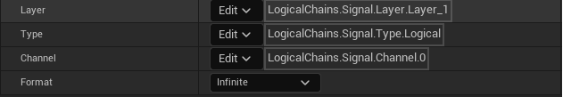
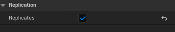
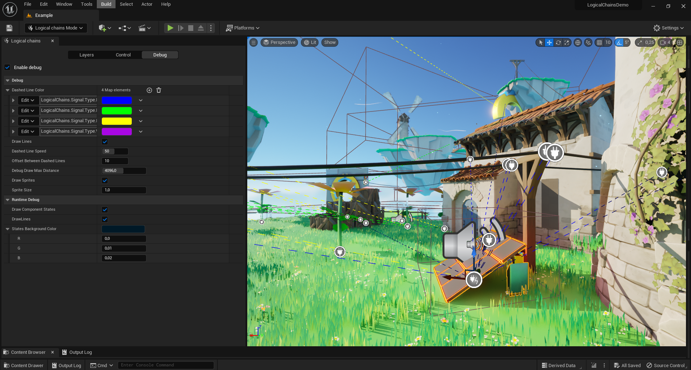
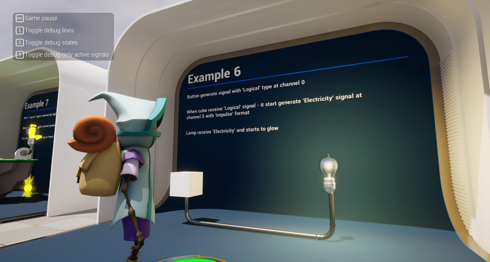
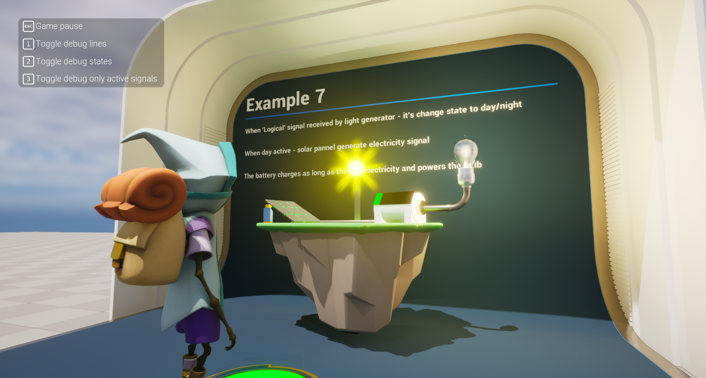

Are you tired of the monotonous creation of entity binding logic? Are you constantly thinking about replication? Saving states make your head ache? With our plugin you will forget about this.

**Advanced Logic Chains is a plugin that combines several components to create complex logic based on event-like signals and states**

Spend your time making the game, not solving problems

📺Introduction trailer: [Click here to watch on YouTube](https://www.youtube.com/watch?v=5d709hQEYsg)

📺Hype trailer: [Click here to watch on YouTube](https://youtu.be/ORbq8y8v53c)

📂Demo project: [Click here to download](https://drive.google.com/drive/folders/1iB-wzi5HbQ1Z6RaKk9LkEErb7-Z9iFu6?usp=sharing)

📂Example project for owners: [Click here to download](https://drive.google.com/drive/folders/1H2EZMnxkOb9KNYtfeYfUN-U6V6ydbAlO?usp=sharing)

📝Changelog: [Click here to see](https://github.com/SpaceRaccoonGameStudio/AdvancedLogicalChains/blob/main/CHANGELOG.md)

➡️Roadmap: [Click here to watch on YouTube](https://github.com/orgs/SpaceRaccoonGameStudio/projects/2/views/1)

🚧Issue tracker: [Click here to watch on YouTube](https://github.com/SpaceRaccoonGameStudio/AdvancedLogicalChains/issues)

💬Support Discord group: [Click here to join](https://discord.gg/4FtCJnMuxb)

✅Our other plugins: [Click here to see](https://www.unrealengine.com/marketplace/en-US/profile/Space+Raccoon+Game+Studio?count=20&sortBy=effectiveDate&sortDir=DESC&start=0)

# Table of content:
 - [Features](#features)
 - [How does it work?](#how-it-is-work)
 - [Installation](#installation)
 - [Components](#components)
 - [Editor mode](#editor-mode)
 - [Project settings](#project-settings)
 - [Console commands](#console-commands)
 - [Examples](#examples)

# Features

* Fast and easy construction of gameplay logic
* Custom editor mode for easy creation and debugging
* Full multiplayer support
* Accelerated creation of logic in blueprints
* Easy integration
* No need to use soft/hard reference pointers
* Fully written in C++
* Optimized for big worlds (full world partition support)
* Production ready

# How does it work?

## Simplified scheme of work

## Core

The plugin is based on three components - **Logical state**, **Logical receiver** & **Logical generator** components. 
Components are connected by signals and states. 

## Signal

Signal is a structure containing:

1) **Layer** - gameplay tag indicating the current layer on which the signal operates
1) **Type** (e.g. Logical, Electricity, Wind, etc) - This is a special gameplay tag that describes the type of a signal. By default there are several types that are ready to use, but they can be easily extended by adding new tags
2) **Channel** (e.g. 0, 1, etc) - Channels are necessary in order not to use a huge number of unique signal types. At their core, they are gameplay tags and can also be expanded by adding new tags.
3) **Format** - Signal format: **Infinity** or **Impulse**. Currently only **Infinity** type is supported.

## States

A set of states controls the behavior of an actor based on signals. States can be inherited from a data asset or added directly to a component. Events for changing states and state management functions are also available (such as set state or get current/previous state).

# Installation

First you need to install the plugin on the engine. You can do this through the official epic games launcher.

## Using the plugin as the project plugin

If you want use the plugin as the project plugin you can manually copy the plugin from “**Engine/Plugins/Marketplace/LogicalChains**” folder to your “**Project/Plugins/LogicalChains**” folder

**WARNING: FOR SUCCESSFUL PACKAGE BUILD - YOU NEED USE C++ PROJECT!**

# Components
## Logic State Component
Logic State Component is the basic element in the construction of chains. The component's settings specify an array of states in which the actor can be.
It is used to switch the states of actors: manually (for example from blueprints), based on replication, or by using a **Logical receiver component**. 

**Logical state component is required for all actors that need to receive or send signals**, it connects signals and logic inside the actor.

**For example:**

**Light bulb**: activated, deactivated, broken

**Sun**: day, night, morning, evening

**Door**: open, closed, locked

## Logical Signal Generator Component
Logical Signal Generator Component creates signals based on the state of the actor.

**For example:**

**Diesel generator**: when activated, it generates noise and electricity. When deactivated, it generates nothing. When broken, it generates only noise.

## Logical Signal Receiver Component
Logical Signal Receiver Component switches the actor's states based on the signals received from other actors.

**For example:**

**Light bulb**: when it receives electricity, it changes state to activated. If the electrical signal is lost, it switches to a deactivated state (in case the light bulb is not in the broken state).

## Networking and Multiplayer

For networking, replication of actors (component owners) is required.
Enable **Replicates** in the actor settings

# Editor mode

The mode is used to conveniently configure logical signal chains with support for real-time debugging

**Enable logical chains editor mode:**

**Easy draw debugging controls inside editor mode:**

# Project settings

The project settings contain the main settings for debugging the plugin. You can find it in "**Project settings -> Game -> Advanced logical chains**"

**Dashed Line Color** - sets the color of the dotted line connecting generators and receivers.

**Draw Lines** - whether or not to display connection lines.

**Dashed Line Speed** - speed at which the dashed line will move.

**Offset Between Dashed Lines** - vertical offset between signal lines.

**Debug Draw Max Distance** - sets the distance from camera where you want to stop displaying drawn lines.

**Draw Sprites** - whether or not to display component's sprites.

**Draw Component States** - whether or not to display component's states in runtime debug.

# Console commands

**LogicalChains.ToggleStatesDebug** - text debug for actor state

**LogicalChains.ToggleRuntimeDebug** - dashed line debug

**LogicalChains.DebugDraw.OnlyActiveSignals [true/false]** - only display active dashed lines

# Examples

[CREATE SIMPLE LOGIC](examples/EXAMPLE_01.md)

## Demo project

This example is available in our demo project:

