## Create simple logic

Here is an illustrated example of simple logic creation for two actors.

Name them **BP_Generator** and **BP_Light_Bulb**

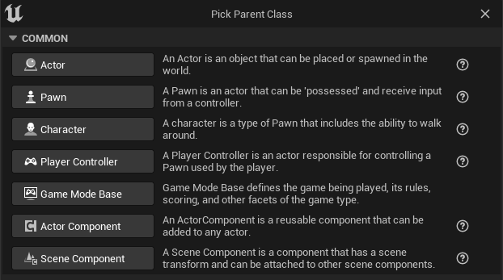

Create new **LogicalStateDataAsset** and name it **DA_States_Default**

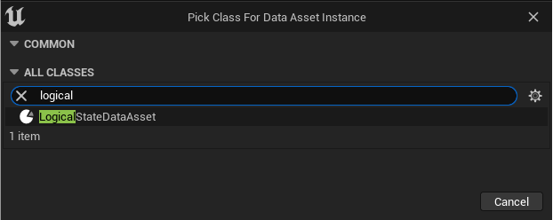

Add two new lines to the data asset: **Activated** and **Deactivated**

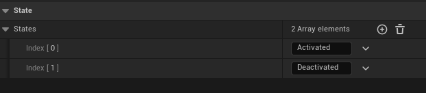

Add **Logical State** and **Logical Signal Generator** components to **BP_Generator**

In the **Logical State** component settings, select **DA_States_Default** as **Parent States** and **Deactivated** as **Initialization State**

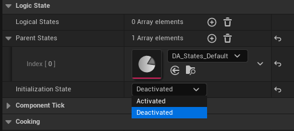

In the **Logical Signal Generator** component settings, add a new **Generator Signal**.

In the signal settings, add a new element to the **Activation States** array - **Activated** (this is the state that allows signals to generate).

Add a new item to the **Signals** array and select your signal type tag and signal channel tag.

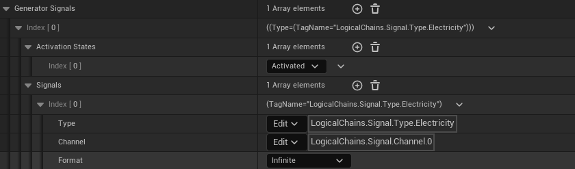

Add **Point Light**, **Logical State** and **Logical Signal Receiver** components to **BP_Light_Bulb**

In the **Logical State** component settings, select **DA_States_Default** as **Parent States** and **Deactivated** as **Initialization State**

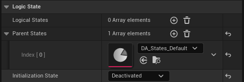

In the **Logical Signal Receiver** component settings, add new **Signals to Receive**.

In the signal settings, set **Activated** to **State on Signal** and **Deactivated** to **State on Lost Signal**.

Add a new item to the signals array and select the same signal type tag and signal channel tag.

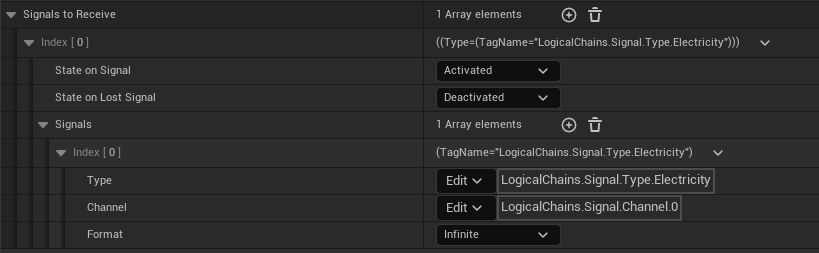

Add a new event to the **Logical State** component **OnStateChanged**

Add a switch node

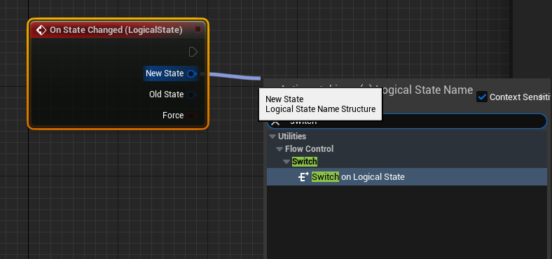

In the switch node settings, click the **Add All States** button

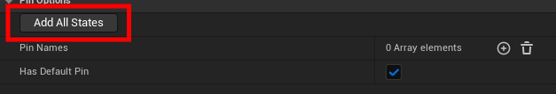

Add **Set Visibility** for **Point Light**

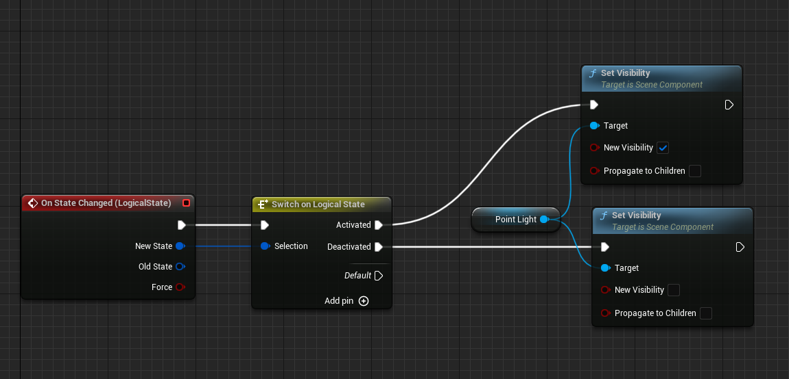

Add our two actors to the map and switch the editor to **Logical Chains mode**.

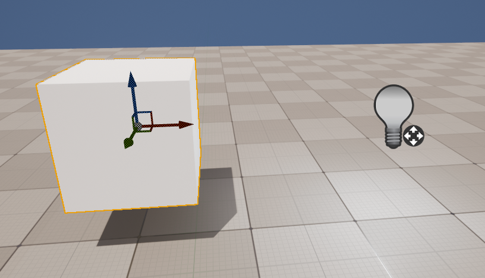

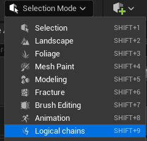

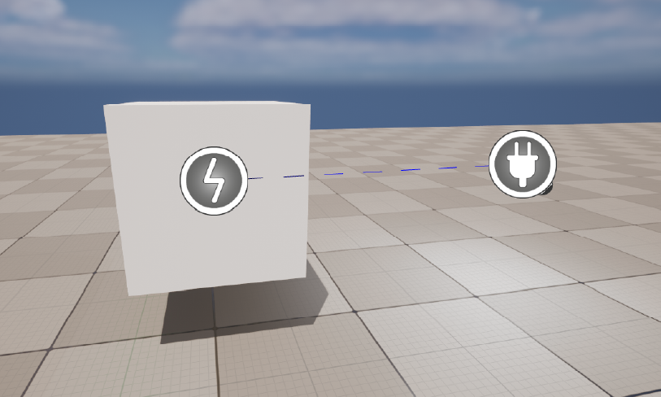

To test it, let's add some code to the level blueprint (If you have an interactive system in your project, you can use it)

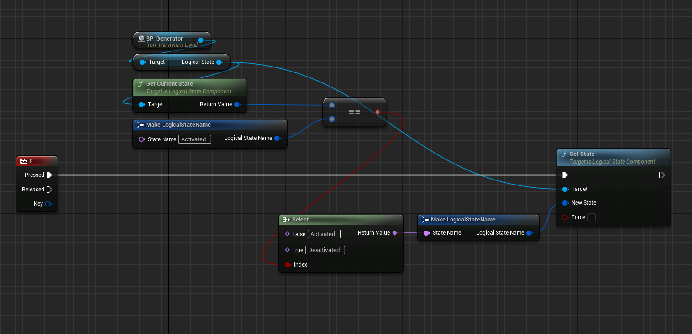

Now we can check

Now let's try adding a switch and extra bulbs to our circuit

Create new a actor and name it **BP_Switch**

Add **Logical State** and **Logical Signal Generator** components

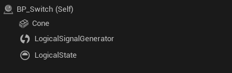

**Logical State Component** settings

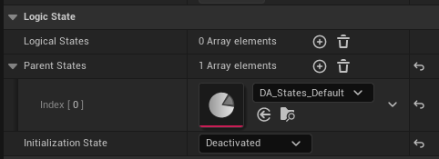

**Logical Signal Generator** settings

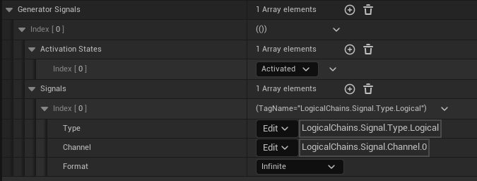

It's the same **BP_Generator** that creates a different signal, but in it, we'll add a visual display of the toggle. Select **OnStateChanged** in the **State component**

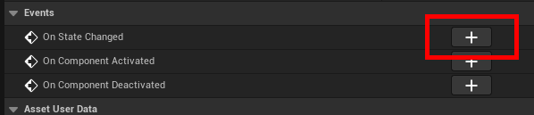

Add the desired logic. In my example I switch the color of the cone.

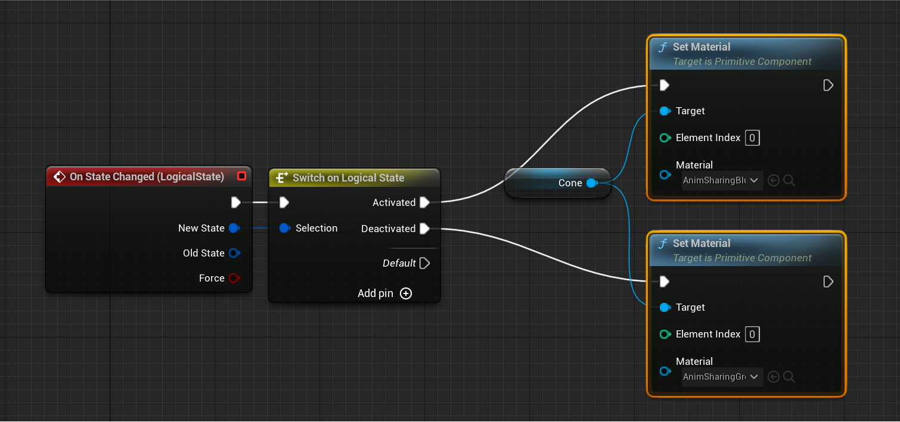

In the bulb settings on the scene change the conditions and add a new signal to turn it on. 

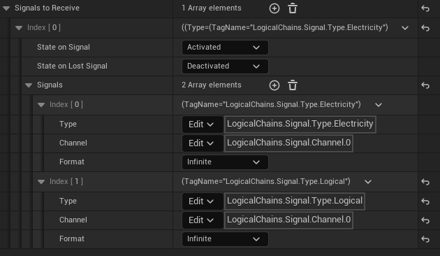

Add **BP_Switch** to the scene and code to check work in level blueprint

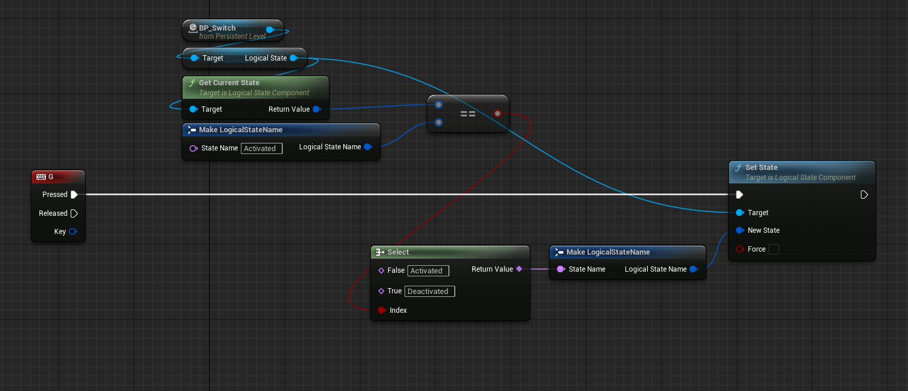

We can also create additional bulbs and configure their own unique behavior.
In the example below the top bulbs are connected only to the generator and the right one is connected to the switch and the generator.

